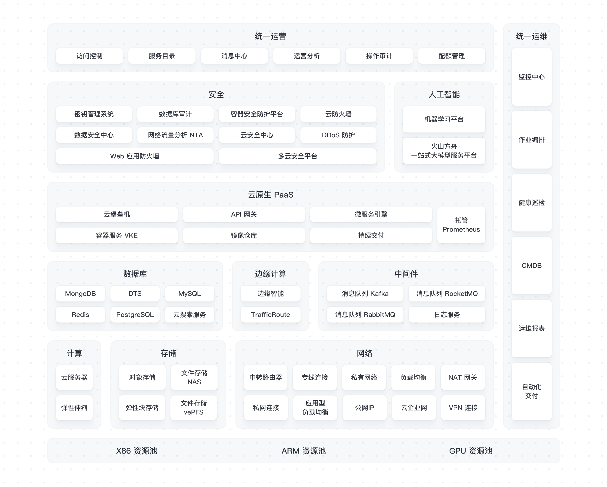
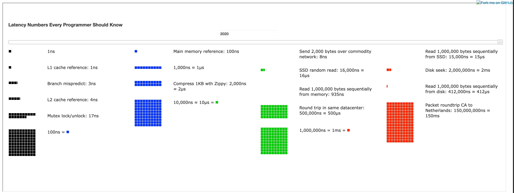

# Overview
先喝一碗毒鸡汤：车马春山慢慢行

成为一名架构师之前，你需要先成为一名合格的开发者，需要掌握一门编程语言、需要熟练使用linux、容器服务、镜像仓、代码仓，数据库、消息队列、缓存等等

软件设计原则：可读性、可维护、安全、可靠、可测试、高效、可移植。

目标：体验一致、可持续发展、低耦合、可扩展、轻量化运行

# 云架构图

> 图片源至[火山引擎veStack](https://www.volcengine.com/product/veStack)

- 公有云：
公有云通过互联网提供计算、存储、网络、开发和部署环境以及应用等资源。一般以 *租户* 区分资源 

- 私有云：
私有云由一个组织（通常位于本地）构建、运行和使用。它们可提供更强的控制力度、自定义和数据安全，但也存在与传统 IT 环境类似的成本和资源限制。

- 混合云：
将至少一个私有计算环境（传统 IT 基础设施或私有云，包括边缘）与一个或多个公有云进行混合的环境称为混合云。混合环境可让您利用不同计算环境中的资源和服务，并选择最适合工作负载的资源和服务。

# 每个程序员都应该知道的延迟数字

https://colin-scott.github.io/personal_website/research/interactive_latency.html

|操作|延迟|10亿次延迟|
|--|--|--|
|L1 缓存查询|1ns|1s|
|分支预测错误（Branch mispredict）|3ns|3s|
|L2 缓存查询|4ns|4s|
|互斥锁/解锁|17ns|17s|
|在 1Gbps 的网络上发送 2KB|44ns|44s|
|内存访问	|100ns|100s|
|zip压缩1KB	|2000ns|2000s|
|从内存顺序读取 1 MB|3000ns|3000s|
|SSD 随机读|16000ns|16000s|
|从 SSD 顺序读取 1 MB|49000ns|49000s|
|同一个数据中心往返	|50000ns|50000s|
|从磁盘顺序读取 1 MB	|825000ns|825000s|
|磁盘寻址	|2000000 ns (2 ms)|2000000s|
|从美国发送到欧洲的数据包	|150000000 ns（150 ms）ns|150000000s|

> 1s = 1000ms = 1000000us = 1000000000ns
- 可以看出，从远程服务器的内存中读数据要比直接从硬盘上读取要快的。
- cpu负责算，内存负责存，cpu从内存里面取值，计算后存在内存里
